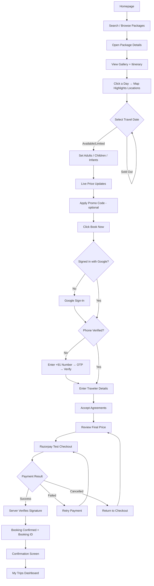

# Voyage India — User Flow

⬅ [[Home]] · Related: [[PRD]] · [[UI-Design-Spec]] · [[AI-Guardrails]]

---

## 1. Primary Flow (Demo Path)

This exact path is the rehearsed demo script: [[Implementation-Plan#5. Demo Script]].

## 2. Gating Rules (enforced at each checkpoint)

| Checkpoint | Rule |
|---|---|
| Book Now click | If not signed in → route to Google sign-in first |
| After sign-in | If phone not verified → route to OTP verification before any checkout field is shown |
| Date selection | Sold-out dates are disabled, not just visually greyed — clicking does nothing |
| Traveler selector | Adults cannot go below 1; no field can go negative |
| Payment step | Booking document stays `pending` until Cloud Function verifies Razorpay signature — only then does it become `confirmed` and appear in My Trips |
| Agreements | Pay Now button stays disabled until all checkboxes are checked |

> [!danger] These gates are non-negotiable
> They're the [[PRD#12. Validation Rules|PRD's explicit validation rules]] — see [[AI-Guardrails#3. Never Cut]].

## 3. Secondary Flows

**Visitor browsing only (no auth):**
Homepage → Search/Filter → Package Details → Itinerary/Map/Pricing exploration → (stops before Book Now; can view everything except complete a booking).

**Returning verified user:**
Homepage → Package Details → Book Now → *(skips Google sign-in and OTP — session + phone verification persist)* → Traveler Details → Agreements → Payment.

**Payment failure recovery:**
Razorpay Checkout fails or is cancelled → user is returned to the checkout screen with the same booking summary intact (not re-entering traveler details) → can retry payment.

## 4. Screen-Level Sequence

1. Homepage
2. Package Listing (may be same screen as Homepage)
3. Package Details (gallery → itinerary → map → date → travelers → price)
4. Auth modal (Google → Phone OTP), triggered from Book Now
5. Checkout (traveler details → dietary → agreements)
6. Razorpay Checkout (external widget)
7. Booking Confirmation
8. My Trips

Visual treatment of each screen: [[UI-Design-Spec#3. Screen-by-Screen Spec]].

---

## Related Notes
- [[Home]]
- [[PRD]] — why these gates exist
- [[UI-Design-Spec]] — how each screen in this flow looks
- [[Implementation-Plan]] — the rehearsed demo script following this flow
- [[AI-Guardrails]] — treat these gates as non-negotiable
